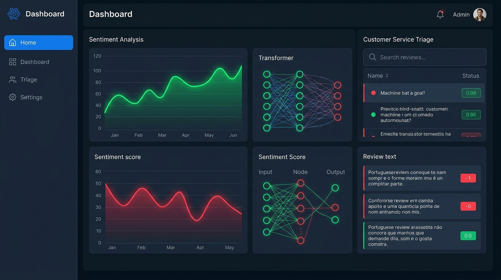

# Brazilian-E-commerce-Review-Sentiment-Analysis

Binary sentiment classification (positive / negative) of **Olist** customer reviews, benchmarking **45+ model runs** across classical, transformer, and deep-learning families, then turning the best one into a working customer-service triage tool.
 
> Sentiment is fully determined by the text a customer already wrote — there's no future event to forecast — so these results are high-confidence and reproducible, unlike delay/cancellation prediction.
 
---
 
## 🧭 Overview
 
This project classifies Olist review text as **positive** or **negative** and compares model families from three published approaches:
 
- **Sarker et al. (STI 2022)** — LSTM, BiLSTM, CNN-LSTM, CNN-BiLSTM + m-BERT / XLM-R fine-tuning
- **Shanto et al. (IJIEEB 2023)** — Logistic Regression, Random Forest, SVM (linear & RBF), Naive Bayes, KNN, SGD, Decision Tree over TF-IDF / CountVectorizer (uni/bi-gram)
- **Sarowar et al. (I2CT 2019)** — stop-word filtering + TF-IDF + a hybrid KNN-clustering / SVM ensemble
On top of the modeling, the best classifier is deployed against **every** written review to build a customer-service negative-review priority queue and a category/seller sentiment trend dashboard.
 
---
## 🏗️ Data Pipeline (Upstream)

Raw preprocessing and data warehousing happen **outside this repo**, in a companion project: [**brazilian-ecommerce-dwh**](https://github.com/Anikalfa/brazilian-ecommerce-dwh). That repo builds a SQL-based data warehouse from the raw Olist CSVs using a **medallion (bronze → silver → gold) architecture**:

| Layer | Purpose |
|---|---|
| 🥉 **Bronze** | Raw Olist tables loaded as-is into the warehouse |
| 🥈 **Silver** | Cleaned, validated, and standardized tables (data quality checks applied) |
| 🥇 **Gold** | Business-ready, aggregated/joined tables for analytics and modeling |

It also includes database creation scripts, an SSIS pipeline, and a dedicated data-quality-check module. This notebook consumes the cleaned, modeled output of that warehouse as its starting point, then focuses on **feature engineering and machine learning** on top of it.

> 📌 See the [DWH repo](https://github.com/Anikalfa/brazilian-ecommerce-dwh) for the full ETL/warehouse implementation.

## 🧹 Data Preparation
 
| Step | Detail |
|---|---|
| Source | Olist `order_reviews_dataset.csv` (98,410 reviews) |
| Filter | Only reviews with written text kept; neutral score (3) dropped as genuinely ambiguous |
| Text | `review_comment_title` + `review_comment_message` combined into `full_text` |
| Label | `positive` if `review_score` ≥ 4, else `negative` |
| Final dataset | **33,471** labeled reviews (37,113 before duplicate-text removal) → 68.8% positive / 31.2% negative |
| Split | 80 / 20 stratified train/test (**26,776** train / **6,695** test) |
 
### Data-leakage safeguards
- **Exact-duplicate review texts dropped before splitting** (3,642 duplicates removed, 9.8% of the dataset) — copy-pasted/templated reviews could otherwise leak into both train and test.
- **Assertion confirms zero text overlap** between train and test after the split.
- Keras `Tokenizer` and the fastText embedding lookup are fit on **`X_train` only**.
- Transformer fine-tuning subsamples are drawn from `X_train`/`y_train` only; the held-out test set is untouched until final evaluation.
- All model/result dictionaries are asserted or de-duplicated so re-running cells can't silently double-count a model or repeat a results row.
---
 
## 🤖 Modeling Approaches
 
### 1. Classical ML suite (Shanto et al. / Sarowar et al. style)
**36 configurations** — 9 classifiers × 4 vectorizers (TF-IDF unigram/bigram, Count unigram/bigram):
 
`LogisticRegression · RandomForest · LinearSVM · RBFSVM · MultinomialNB · SGD · DecisionTree · KNN · HybridKNN_SVM`
 
`HybridKNN_SVM` is a custom estimator reproducing Sarowar et al. (2019): k-means clusters the training data, one SVM is trained per cluster, and new samples are routed to their nearest cluster's SVM at inference.
 
**Top 10 classical configurations (of 36):**
 
| Rank | Vectorizer + Classifier | Accuracy | F1 (weighted) | Train time |
|:---:|---|:---:|:---:|:---:|
| 1 | **count_bi + SGD** | **0.9344** | **0.9350** | 0.1s |
| 2 | count_bi + LogisticRegression | 0.9334 | 0.9338 | 1.4s |
| 3 | tfidf_bi + LinearSVM | 0.9298 | 0.9304 | 0.1s |
| 4 | tfidf_bi + RBFSVM | 0.9289 | 0.9296 | 83.6s |
| 5 | tfidf_bi + HybridKNN_SVM | 0.9288 | 0.9293 | 38.1s |
| 6 | count_uni + SGD | 0.9280 | 0.9286 | 0.1s |
| 7 | tfidf_uni + RBFSVM | 0.9276 | 0.9284 | 50.7s |
| 8 | count_uni + LogisticRegression | 0.9268 | 0.9275 | 1.3s |
| 9 | tfidf_bi + LogisticRegression | 0.9253 | 0.9265 | 1.3s |
| 10 | tfidf_uni + LinearSVM | 0.9231 | 0.9240 | 0.1s |
 
**Best classical model: `count_bi + SGD`** — F1 = 0.9350
 
### 2. Zero-shot pretrained transformer (baseline)
`nlptown/bert-base-multilingual-uncased-sentiment` (1–5 star model), evaluated with no fine-tuning on a 4,000-review sample:
 
| Metric | Score |
|---|:---:|
| Exact star-rating accuracy | 0.6240 |
| Binary (pos/neg) accuracy | 0.8163 |
| Binary F1 (weighted) | 0.8228 |
 
### 3. Fine-tuned transformer backbones
Four backbones fine-tuned for 2 epochs on an 8,000-review stratified subsample, evaluated on the full held-out test set:
 
| Backbone | Accuracy | F1 (weighted) | Notes |
|---|:---:|:---:|---|
| **neuralmind/bert-base-portuguese-cased (BERTimbau)** | **0.9467** | **0.9471** | 🏆 Best fine-tune — Portuguese-specific |
| xlm-roberta-base | 0.9403 | 0.9406 | Best backbone in Sarker et al. STI 2022 |
| bert-base-multilingual-cased (m-BERT) | 0.9238 | 0.9239 | Second-best in Sarker et al. |
| distilbert-base-multilingual-cased | 0.9153 | 0.9160 | Original notebook's baseline |
 
### 4. Deep sequence models (Sarker et al. STI 2022 style)
Keras models on padded sequences (max 150 tokens), embeddings initialized with pretrained **Portuguese fastText** vectors (`cc.pt.300.vec`, 76.5% vocabulary coverage), class-weighted for the ~31/69 imbalance:
 
| Model | Accuracy | F1 (weighted) |
|---|:---:|:---:|
| **BiLSTM** | **0.9352** | **0.9357** |
| CNN-BiLSTM | 0.9271 | 0.9281 |
| LSTM | 0.3125 | 0.1488  |
| CNN-LSTM | 0.3125 | 0.1488  |
 
 
---
 
## 🏆 Full Model Comparison (All Approaches, Ranked)
 
| Rank | Approach | Accuracy | F1 (weighted) | Family |
|:---:|---|:---:|:---:|---|
| 1 | **Fine-tuned BERTimbau (Portuguese BERT)** | **0.9467** | **0.9471** | Transformer fine-tune |
| 2 | Fine-tuned XLM-RoBERTa | 0.9403 | 0.9406 | Transformer fine-tune |
| 3 | BiLSTM | 0.9352 | 0.9357 | Deep sequence model |
| 4 | Best classical (count_bi + SGD) | 0.9344 | 0.9350 | Classical ML |
| 5 | tfidf_bi + RBF SVM | 0.9289 | 0.9296 | Classical ML |
| 6 | tfidf_bi + Hybrid KNN-cluster + SVM | 0.9288 | 0.9293 | Classical ML (Sarowar et al.) |
| 7 | CNN-BiLSTM | 0.9271 | 0.9281 | Deep sequence model |
| 8 | Fine-tuned m-BERT | 0.9238 | 0.9239 | Transformer fine-tune |
| 9 | Fine-tuned DistilBERT-multilingual | 0.9153 | 0.9160 | Transformer fine-tune |
| 10 | nlptown multilingual BERT (zero-shot) | 0.8163 | 0.8228 | Pretrained, no fine-tune |
| 11 | LSTM | 0.3125 | 0.1488 | Deep sequence model (failed to converge) |
| 12 | CNN-LSTM | 0.3125 | 0.1488 | Deep sequence model (failed to converge) |
 
### Why BERTimbau won
- **Language-specific pretraining wins over general multilingual pretraining.** Olist reviews are Portuguese; a BERT pretrained specifically on Portuguese text (BERTimbau) outperformed both multilingual transformers (XLM-R, m-BERT) and the multilingual DistilBERT baseline.
- **Fine-tuning beats zero-shot by a wide margin** (0.9471 vs 0.8228 F1) — the star-rating model (`nlptown`) was never trained for this exact positive/negative task or this domain's language patterns.
- **Classical ML remains extremely competitive.** A simple SGD classifier on bigram counts (`count_bi + SGD`) lands just 0.0121 F1 behind the best deep sequence model and beats two of four fine-tuned transformers — a good reminder to always benchmark a fast, cheap baseline before reaching for heavier models.
- **Not every deep model works out of the box.** Both single-direction models (LSTM and CNN-LSTM) collapsed to majority-class prediction, while their bidirectional counterparts (BiLSTM and CNN-BiLSTM), trained with the identical embeddings and data, reached the two best non-transformer scores — bidirectionality, not raw model capacity, was the deciding factor here.
---
 
## 🛠️ Applied Outputs
 
Beyond the benchmark, the best classical model (`count_bi + SGD`) is deployed against the **full** review dataset to power two operational tools:
 
### Customer-service negative-review queue
Every written review is scored; the 500 highest-confidence negative predictions are exported as a prioritized queue (`review_id`, `order_id`, `review_score`, `full_text`, `neg_confidence`) for CS agents to act on first.
 
### Category / seller sentiment dashboard
Reviews are joined back to product category, seller, and purchase month to surface:
- **Worst-performing categories** by predicted negative rate — e.g. `office_furniture` (47.4%), `air_conditioning` (42.2%), `agro_industry_and_commerce` (40.7%)
- **Worst-performing sellers** by predicted negative rate, filtered to sellers with ≥20 reviews
- A **monthly negative-rate trend line** to catch emerging quality or logistics issues early
---
 
## 💡 Conclusion & Insights
 
- **Domain-specific pretraining beats general multilingual pretraining.** BERTimbau's Portuguese-only pretraining gave it an edge over XLM-R and m-BERT despite those models seeing far more total training data.
- **A well-tuned classical baseline is nearly free and nearly as good.** `count_bi + SGD` trains in a tenth of a second and lands within striking distance of every transformer except the top one — worth deploying first, especially where GPU cost matters.
- **Bidirectionality matters more than model family.** BiLSTM beat the plain LSTM by more than 60 F1 points using the identical embedding and training setup — direction of context, not depth, was the deciding factor.
- **The Sarowar et al. (2019) hybrid KNN-cluster + SVM ensemble** performed respectably (0.929 F1) but did not clearly beat a plain linear SVM at this dataset's scale — clustering appears to help more on the smaller Bangla corpus in the original paper than on Olist's larger, more diverse review set.
- **This model is production-ready for CS triage today.** Because sentiment is derived from text that already exists (not a future outcome), these accuracy numbers are trustworthy at face value and the negative-review queue can be handed to a customer-service team with confidence.
- **Category and seller sentiment trends point to concrete next steps** — `office_furniture` and a handful of specific sellers have negative rates 3–4× the healthiest categories, making them the natural first targets for a quality or logistics investigation.
---
 
## 🛠️ Tech Stack
 
`Python` · `scikit-learn` · `XGBoost` · `TensorFlow / Keras` · `PyTorch` · `Hugging Face Transformers` · `fastText (Portuguese, cc.pt.300.vec)` · `pandas` / `NumPy` · `matplotlib` / `seaborn`
 
**Environment:** Kaggle Notebook, GPU recommended (tested on 2× Tesla T4). Fine-tuning all four transformer backbones plus the fastText download in one pass is heavy — trim `FT_MODEL_NAMES` if you're short on GPU time or internet access.
 
## 📁 Data
 
[Brazilian E-Commerce Public Dataset by Olist](https://www.kaggle.com/datasets/olistbr/brazilian-ecommerce) (Kaggle)
 
## 📚 References
 
- Sarker, Sadat, and Das, *"Book Review Sentiment Classification in Bangla using Deep Learning and Transformer Model"*, STI 2022
- Shanto, Ahmed, Hossain, Roy, and Jony, *"Binary vs. Multiclass Sentiment Classification for Bangla E-commerce Product Reviews: A Comparative Analysis of Machine Learning Models"*, IJIEEB 2023
- Sarowar, Rahman, Ali, and Rakib, *"An Automated Machine Learning Approach for Sentiment Classification of Bengali E-Commerce Sites"*, I2CT 2019
 
